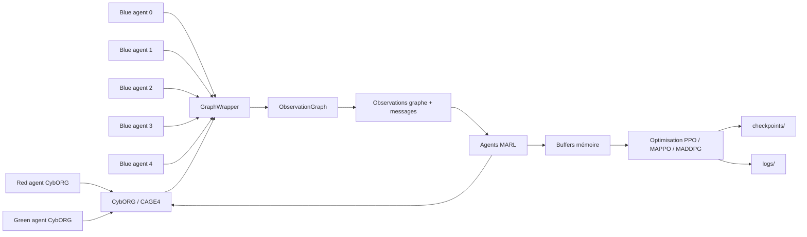
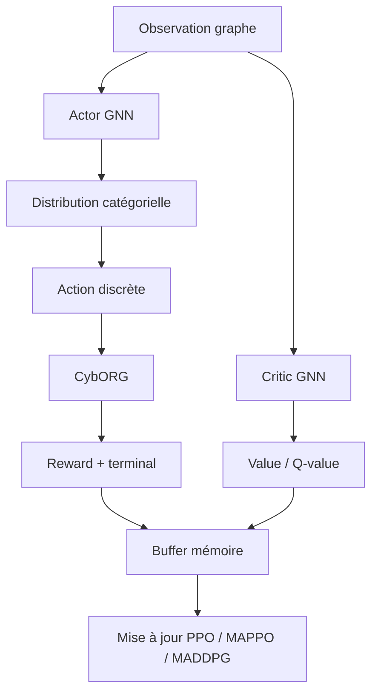

# Adversarial MARL Cyber

Documentation officielle du projet de Multi-Agent Reinforcement Learning (MARL) appliqué à l’environnement CybORG/CAGE4, avec observations structurées en graphe et politiques neuronales basées sur GNN.

Ce dépôt contient le code d’entraînement, les environnements, les agents PPO/MAPPO/MADDPG, les buffers mémoire, les checkpoints, les logs et les scripts d’orchestration des expériences. Il n’inclut pas, à l’état actuel du workspace, de Dockerfile, de pipeline CI/CD, de notebook `.ipynb` ni de manifeste de dépendances `requirements.txt`/`pyproject.toml`.

## Présentation

### Nom du projet

Adversarial MARL Cyber.

### Résumé du problème traité

Le projet étudie le contrôle multi-agent d’un environnement cyber défensif simulé dans CybORG/CAGE4. Cinq agents bleus coopèrent pour analyser, restaurer, contenir et monitorer des sous-réseaux, tout en observant un espace d’état partiellement structuré autour d’un graphe dynamique.

### Motivation

Le cœur scientifique du dépôt est d’évaluer des politiques MARL capables d’exploiter à la fois des signaux tabulaires et une topologie réseau évolutive. L’usage de GNN vise à injecter une inductive bias adaptée aux relations hôte-processus-réseau.

### Cas d’usage

- Recherche en MARL décentralisé et centralisé.
- Expérimentation sur des environnements cyber de type CAGE4.
- Comparaison d’encodeurs GCN et GAT pour des états en graphe.
- Sauvegarde et reprise d’entraînements multi-agents.

### Objectifs de recherche

- Apprendre des politiques robustes dans un environnement cyber partiellement observable.
- Comparer PPO, MAPPO et MADDPG sur une même base environnementale.
- Étudier l’effet d’encodeurs de graphe différents sur la performance.
- Centraliser ou décentraliser la fonction de valeur selon l’algorithme.

### Contributions principales

- Wrapping de CybORG/CAGE4 dans un observateur graphe dynamique.
- Politiques et critics GNN inductifs pour actions discrètes.
- Support d’entraînement multi-agent avec buffers séparés.
- Checkpoints et logs sérialisés par exécution.
- Scripts de lancement d’expériences parallèles.

## Vue d’ensemble du système

Le pipeline opérationnel est le suivant :

1. `src/main.py` charge la configuration YAML via `src/utils/config_loader.py`.
2. `src/trainers/builders.py` instancie les agents et les environnements.
3. `src/environments/cage4/env_factory.py` construit un scénario CybORG Enterprise.
4. `GraphWrapper` transforme les observations tabulaires CybORG en observation graphe.
5. `ObservationGraph` maintient la représentation dynamique des systèmes, connexions, fichiers et nœuds Internet.
6. Les agents PPO/MAPPO/MADDPG génèrent des actions discrètes.
7. Les collecteurs alimentent les buffers mémoire dédiés.
8. Les updaters optimisent les réseaux, puis les checkpoints et logs sont écrits sur disque.

### Diagramme d’interaction



## Algorithmes MARL utilisés

### Algorithmes effectivement implémentés

| Algorithme | Statut dans le code | Remarque |
|---|---:|---|
| PPO | Implémenté | Classe `InductiveGraphPPOAgent` |
| MAPPO | Implémenté | Classe `InductiveGraphMAPPOAgent` avec critic centralisé |
| MADDPG | Implémenté | Classe `InductiveGraphMADDPGAgent` avec critic action-centralisé |
| IPPO | Implicite | Le mode PPO multi-agent du dépôt correspond à une politique indépendante par agent, mais aucune classe `IPPO` explicite n’existe |

### Algorithmes demandés mais absents du dépôt

| Algorithme | Statut |
|---|---:|
| QMIX | Non trouvé |
| VDN | Non trouvé |
| COMA | Non trouvé |
| QTRAN | Non trouvé |
| HAPPO | Non trouvé |
| HATRPO | Non trouvé |
| MASAC | Non trouvé |
| Algorithmes personnalisés | Oui, via les variantes graph-inductives PPO/MAPPO/MADDPG |

### PPO

- Description: optimisation on-policy avec rapport de probabilités tronqué et bonus d’entropie.
- Principe: chaque agent stocke ses transitions dans `MultiPPOMemory`, calcule les retours discountés, normalise l’avantage, puis met à jour actor et critic.
- Architecture réseau: `InductiveActorNetwork` + `InductiveCriticNetwork`.
- Hyperparamètres observés: `gamma=0.99`, `lmbda=0.95`, `clip=0.1`, `epochs=4` ou `6` selon le constructeur utilisé, `batch_size=2500`, bonus d’entropie `0.01`.
- Avantages: simple, stable, adapté au déploiement indépendant par agent.
- Limitations: pas de critic centralisé, donc moins informatif que MAPPO dans un cadre coopératif.

### MAPPO

- Description: variante multi-agent de PPO avec critic centralisé.
- Principe: les acteurs restent locaux, mais la valeur est évaluée sur une observation globale construite via `build_global_observation`.
- Architecture réseau: `InductiveActorNetwork` + `CentralizedCriticNetwork`.
- Hyperparamètres observés: mêmes hyperparamètres PPO, critic partagé entre agents, `batch_size=2500`, `epochs=4`.
- Avantages: meilleure estimation de la valeur dans un contexte coopératif.
- Limitations: critic plus lourd; dépend d’une observation globale cohérente.

### MADDPG

- Description: DDPG multi-agent discret avec critic centralisé sur les actions jointes.
- Principe: chaque agent dispose d’un actor local, d’un critic centralisé et d’un target actor/critic. Les actions des autres agents sont prises en compte via la mémoire et le critic joint.
- Architecture réseau: `InductiveActorNetwork` + `CentralizedActionCriticNetwork`.
- Hyperparamètres observés: `gamma=0.99`, `tau=0.01`, `bs=128` dans la classe, avec `batch_size=2500` dans la configuration d’entraînement actuelle pour les collectes PPO/MAPPO; le critic joint utilise un embedding d’action de dimension `4` par agent.
- Avantages: prise en compte explicite des actions jointes; target networks; mise à jour douce.
- Limitations: implémentation discrète spécifique au projet, plus complexe et plus coûteuse que PPO/MAPPO.

### Algorithmes non implémentés

Les architectures QMIX/VDN/COMA/QTRAN/HAPPO/HATRPO/MASAC ne sont pas présentes dans l’arborescence ni dans les imports. Elles ne doivent pas être considérées comme disponibles dans cet état du dépôt.

## Architecture du projet

### Arborescence racine

```text
.
├── README.md
├── kaggle_run.py
├── kernel-metadata.json
├── projet_detail.md
├── configs/
│   ├── base.yaml
│   ├── eval.yaml
│   └── train.yaml
├── docs/
│   └── ARCHITECTURE.md
├── Final/
│   ├── final1/
│   │   ├── V1/
│   │   │   ├── checkpoints/
│   │   │   └── logs/
│   │   └── V2/
│   │       ├── checkpoints/
│   │       └── logs/
│   └── final2/
├── checkpoints/
├── logs/
├── outputs/
│   └── adversarial-marl-cyber/
│       ├── checkpoints/
│       └── logs/
├── plan/
│   ├── IPPO_MAPPO.md
│   └── IPPO_MAPPO_ARB.md
├── plots/
├── scripts/
│   └── launch_experiments.py
├── src/
│   ├── main.py
│   ├── analys/
│   │   └── plot.py
│   ├── environments/
│   │   └── cage4/
│   │       ├── action_space.py
│   │       ├── action_translator.py
│   │       ├── constants.py
│   │       ├── env_factory.py
│   │       ├── graph_wrapper.py
│   │       ├── topology.py
│   │       └── wrapper_utils.py
│   ├── models/
│   │   ├── agents/
│   │   ├── gnn/
│   │   ├── memory/
│   │   ├── utils/
│   │   └── load.py
│   ├── observations/
│   │   └── graph/
│   ├── trainers/
│   │   ├── builders.py
│   │   ├── checkpoint.py
│   │   ├── collector.py
│   │   ├── config.py
│   │   ├── tpu.py
│   │   ├── train_loop.py
│   │   ├── trainer.py
│   │   └── updater.py
│   └── utils/
│       ├── config_loader.py
│       ├── device.py
│       └── tpu_test_runner.py
└── tests/
		├── test_encoder.py
		├── test_graph.py
		├── test_main.py
		└── test_wrapper_import.py
```

### Rôle des principaux dossiers

| Dossier | Rôle | Dépendances principales |
|---|---|---|
| `configs/` | Définition des paramètres d’entraînement, d’évaluation et des chemins | YAML chargé par `src/utils/config_loader.py` |
| `src/environments/` | Construction de l’environnement CAGE4 et traduction des actions | `CybORG`, wrappers Enterprise, topologie réseau |
| `src/observations/graph/` | Représentation graphe dynamique de l’état observé | `torch`, structures de nœuds, `CybORG` enums |
| `src/models/agents/` | Logique d’action et d’apprentissage des agents | GNN, buffers mémoire, critics |
| `src/models/gnn/` | Encodeurs de graphe, actor, critics, attention | `torch`, `torch_geometric` |
| `src/models/memory/` | Replay buffers et buffers on-policy multi-agent | `torch` |
| `src/trainers/` | Orchestration de l’entraînement, collecte, sauvegarde, reprise | `joblib`, `torch` |
| `scripts/` | Lancement d’expériences en lot | `subprocess`, `sys` |
| `tests/` | Vérifications minimales d’import et de structure | `pytest` ou exécution directe du module |

## Architecture des agents

### Vue fonctionnelle



### Policy Network

L’actor principal est `InductiveActorNetwork`. Il combine :

- un `GraphEncoder` à deux couches (`GCNConv` ou `GATConv`),
- trois blocs de self-attention globale (`SimpleSelfAttention`),
- des têtes séparées pour les actions de nœuds, d’arêtes et d’actions globales.

L’output est une distribution `Categorical` sur l’espace d’actions discret.

### Value Network

Le critic standard `InductiveCriticNetwork` encode le graphe local et produit une valeur scalaire. Dans MAPPO, `CentralizedCriticNetwork` agrège les embeddings de plusieurs agents via attention avant la tête de valeur finale.

### Critic

- PPO: critic local par agent.
- MAPPO: critic centralisé partagé.
- MADDPG: critic centralisé sur état global + actions jointes.

### Actor

Chaque agent possède un actor local. Les actions sont échantillonnées dans la distribution `Categorical`, ou choisies de façon déterministe via `argmax` si le flag `deterministic` est activé.

### Mixing Network

Aucune mixing network de type QMIX/VDN n’est implémentée dans ce dépôt.

### Replay Buffer

Buffers observés dans le code :

- `PPOMemory` et `MultiPPOMemory`.
- `MAPPOMemory` et `MultiMAPPOMemory`.
- `MADDPGMemory` et `MultiMADDPGMemory`.

Le dépôt ne contient pas de dossier `replay_buffers/`; la logique mémoire est regroupée dans `src/models/memory/`.

### Exploration Strategy

- PPO/MAPPO: échantillonnage `Categorical` et bonus d’entropie.
- MADDPG: échantillonnage discret dans le policy, avec target networks.
- Un mode déterministe existe dans les agents, mais il n’y a pas de bruit d’exploration externe de type Ornstein-Uhlenbeck.

## Environnement

### Type d’environnement

`CybORG` en scénario `EnterpriseScenarioGenerator`, exécuté en mode `sim`, avec wrapper `GraphWrapper`.

### Nombre d’agents

5 agents bleus, indexés `blue_agent_0` à `blue_agent_4`.

### Espaces d’observation

Le wrapper produit, pour chaque agent, une observation structurée en graphe contenant :

- matrice de nœuds `x`,
- `edge_index` `ei`,
- vecteur global de phase,
- indices de serveurs et d’utilisateurs,
- nombre de serveurs et d’utilisateurs,
- arêtes d’actions,
- indicateur `multi_subnet`.

Le graphe encode quatre types de nœuds : `SystemNode`, `ConnectionNode`, `FileNode`, `InternetNode`.

### Espaces d’action

L’espace discret est découpé en :

- actions de nœud: `Analyse`, `Remove`, `Restore`, `DeployDecoy`,
- actions d’arête: `AllowTrafficZone`, `BlockTrafficZone`,
- action globale: `Monitor`.

La taille par sous-réseau est donnée par `MAX_ACTIONS = 4 * MAX_HOSTS + 2 * (len(ROUTERS) - 1) + 1`, soit 81 dans la topologie actuelle. L’agent 4 gère trois sous-réseaux et opère donc sur 243 actions locales avant traduction.

### Fonction de récompense

La récompense n’est pas définie dans ce dépôt Python; elle est renvoyée par CybORG/CAGE4 via `super().step(...)`. Le code d’entraînement agrège la récompense moyenne par run et les récompenses par agent dans les logs.

### Conditions terminales

Elles sont fournies par l’environnement CybORG et transmises telles quelles par le wrapper (`term`, `trunc`). Le code du projet ne redéfinit pas la logique terminale.

### Contraintes

- Certains agents peuvent être bloqués pendant une action en cours (`is_blocked`).
- L’agent 4 gère une observation multi-subnet spécifique.
- Les actions sont traduites en objets CybORG via `translate_action`.

### Classes d’environnement documentées

- `GraphWrapper`: convertit l’observation tabulaire en observation graphe et maintient l’état dynamique.
- `ObservationGraph`: structure principale du graphe observé.
- `SystemNode`, `ConnectionNode`, `FileNode`, `InternetNode`: types de nœuds.
- `NodeTracker`: bijection chaîne <-> identifiant entier.
- `GraphUpdatesMixin`: mise à jour incrémentale du graphe.

## Pipeline d’entraînement

### Étapes

1. Initialisation: lecture de la configuration, seed PyTorch, préparation des chemins de logs et checkpoints.
2. Création de l’environnement: un ensemble de workers est instancié via `make_env(seed + i, steps=episode_len)`.
3. Création des agents: sélection de `PPO`, `MAPPO` ou `MADDPG` selon `train.algorithm`.
4. Collecte d’expérience: collecte parallèle d’épisodes via les fonctions `generate_episode_*`.
5. Replay / mémoire: chaque agent remplit son buffer dédié.
6. Optimisation: appel à `learn()` par agent via `joblib.Parallel`.
7. Sauvegarde: écriture des logs `.pt` et des checkpoints `.pt`.
8. Évaluation: non implémentée dans le point d’entrée actuel.

### Diagramme du pipeline

```mermaid
flowchart TD
		A[Configs YAML] --> B[src/main.py]
		B --> C[build_agents / build_envs]
		C --> D[Rollout multi-worker]
		D --> E[MultiPPOMemory / MultiMAPPOMemory / MultiMADDPGMemory]
		E --> F[learn() sur chaque agent]
		F --> G[save_logs()]
		F --> H[save_checkpoints()]
		G --> I[logs/*.pt]
		H --> J[checkpoints/*_checkpoint.pt]
```

### Commande d’entraînement principale

```bash
python -m src.main train
```

### Surcharges de configuration

Le CLI accepte des surcharges répétées via `--override`.

Exemple:

```bash
python -m src.main train \
	--override run.name=exp_mappo_gat \
	--override train.algorithm=mappo \
	--override actor.encoder=gnn_gat \
	--override critic.encoder=gnn_gat \
	--override train.workers=20 \
	--override runtime.max_threads=40
```

## Configuration

Le chargement de configuration fusionne d’abord `configs/base.yaml`, puis `configs/train.yaml` ou `configs/eval.yaml`, puis les surcharges CLI `key=value` via `src/utils/config_loader.py`.

### Paramètres actifs dans les YAML

| Paramètre | Valeur | Description |
|---|---:|---|
| `paths.logs` | `logs` | Répertoire de logs Torch |
| `paths.checkpoints` | `checkpoints` | Répertoire des checkpoints Torch |
| `runtime.max_threads` | `40` | Nombre maximum de threads PyTorch |
| `runtime.max_training_hours` | `11.1` | Budget temps de référence |
| `train.algorithm` | `mappo` | Algorithme par défaut |
| `train.seed` | `42` | Seed principale |
| `train.episode_len` | `500` | Longueur d’épisode |
| `train.episodes_per_update` | `20` | Nombre d’épisodes collectés par update |
| `train.workers` | `20` | Nombre de workers d’rollout |
| `train.batch_size` | `2500` | Taille des mini-batchs |
| `train.training_episodes` | `1500` | Budget d’entraînement |
| `train.epochs` | `4` | Nombre d’époques d’update |
| `train.resume` | `false` | Reprise d’entraînement |
| `train.resume_name` | `null` | Nom de run à reprendre |
| `train.resume_start_iter` | `null` | Itération initiale forcée |
| `train.num_agents` | `5` | Nombre d’agents bleus |
| `train.device` | `auto` | Paramètre de device dans la config, mais non routé explicitement dans `run_train` |
| `actor.lr` | `0.0003` | Learning rate actor |
| `actor.hidden1` | `256` | Couche cachée 1 de l’actor |
| `actor.hidden2` | `128` | Couche cachée 2 de l’actor |
| `actor.encoder` | `gnn_gcn` | Encodeur de graphe par défaut |
| `critic.lr` | `0.001` | Learning rate critic |
| `critic.hidden1` | `256` | Couche cachée 1 du critic |
| `critic.hidden2` | `128` | Couche cachée 2 du critic |
| `critic.encoder` | `gnn_gcn` | Encodeur de graphe par défaut |
| `hyperparams.gamma` | `0.99` | Discount factor |
| `eval.max_eps` | `100` | Nombre max d’épisodes d’évaluation |
| `eval.distribute` | `1` | Paramètre d’évaluation distribué |
| `eval.seed` | `null` | Seed d’évaluation |
| `eval.append_timestamp` | `false` | Ajout d’horodatage |
| `eval.output_path` | `tmp` | Dossier de sortie |

### Notes sur la configuration

- `src/trainers/config.py` contient aussi un `default_config()` Python avec des valeurs différentes de `configs/base.yaml`.
- `src/main.py` charge les YAML, puis applique les surcharges CLI.
- Le script `scripts/launch_experiments.py` force des surcharges supplémentaires pour lancer plusieurs expériences.

### Paramètres absents ou implicites

| Paramètre demandé | État dans le dépôt | Commentaire |
|---|---|---|
| `tau` | Implicite | Défini dans `InductiveGraphMADDPGAgent` avec `tau=0.01`, mais pas exposé dans les YAML |
| Replay buffer size | Implicite | Il n’y a pas de capacité maximale dédiée; `batch_size` contrôle les mini-batchs |
| Evaluation frequency | Absent | Aucun scheduler d’évaluation n’est câblé |
| Exploration parameters | Partiel | Entropie PPO/MAPPO, sampling catégoriel, `deterministic` dans les agents |

## Réseaux de neurones

### Couches et activations

#### GraphEncoder

- `GCNConv(input_dim -> hidden_dim)` puis `GCNConv(hidden_dim -> output_dim)` si `encoder=gnn_gcn`.
- `GATConv(input_dim -> hidden_dim)` avec `heads=8`, `concat=False`, `dropout=0.6`, puis une seconde `GATConv(hidden_dim -> output_dim)` si `encoder=gnn_gat`.
- Activation: `ReLU` après chaque convolution.

#### InductiveActorNetwork

- Encodeur graphe partagé.
- Trois blocs `SimpleSelfAttention` sur les embeddings de phase/nœuds.
- Tête nœuds: MLP jusqu’à `node_action_space=4`.
- Tête arêtes: MLP jusqu’à `edge_action_space=2`.
- Tête globale: MLP jusqu’à `global_action_space=1`.
- Sortie: distribution catégorielle sur le vecteur d’actions concaténé.

#### InductiveCriticNetwork

- Encodeur graphe partagé.
- Trois blocs `SimpleSelfAttention`.
- Tête de sortie: MLP vers un scalaire de valeur.

#### CentralizedCriticNetwork

- Encode chaque observation locale via le critic de base.
- Empile les embeddings des agents.
- Applique une attention inter-agents.
- Termine par une tête de valeur centralisée.

#### CentralizedActionCriticNetwork

- Hérite du critic centralisé.
- Ajoute un embedding d’action discrète de dimension `4` par agent.
- Concatène embedding global et actions jointes.
- Produit une Q-value scalaire.

### Nombre total de paramètres entraînables

Les chiffres ci-dessous ont été calculés à partir des checkpoints sérialisés présents dans `checkpoints/`.

| Famille sauvegardée | Actor params | Critic params | Total entraînable |
|---|---:|---:|---:|
| `maddpg_gat_gat` | 808199 | 828559 | 1636758 |
| `maddpg_gcn_gcn` | 459783 | 480143 | 939926 |
| `mappo_gat_gat` | 808199 | 772802 | 1581001 |
| `ppo_gat_gat` | 808199 | 749953 | 1558152 |

### Observations techniques

- Les checkpoints MADDPG `gcn/gcn` sont nettement plus petits que les variantes `gat/gat`.
- Les variantes PPO et MAPPO utilisent le même actor GAT dans les checkpoints présents, mais des critics de tailles différentes.

## Installation

Le dépôt ne versionne pas de `requirements.txt` ou de `pyproject.toml` dans ce workspace. La liste de dépendances doit donc être reconstruite à partir des imports du code.

### Commandes de base

```bash
git clone <URL_DU_DEPOT>
cd adversarial-marl-cyber
python -m venv .venv
source .venv/bin/activate
pip install -r requirements.txt
```

Si le fichier `requirements.txt` n’existe pas encore dans votre clone, installez au minimum les paquets observés dans le code:

- `torch`
- `torch-geometric`
- `numpy`
- `joblib`
- `pyyaml`
- `CybORG`
- `torch_xla` si vous utilisez le support TPU

## Entraînement

### Commande principale

```bash
python -m src.main train
```

### Arguments CLI du point d’entrée

| Argument | Description |
|---|---|
| `train` | Lance l’entraînement |
| `eval` | Lance l’évaluation; actuellement non implémentée |
| `--override key=value` | Surcharge arbitraire d’une clé de configuration |

### Script de lancement multi-expériences

`scripts/launch_experiments.py` permet de lancer plusieurs entraînements en parallèle.

Exemple:

```bash
python scripts/launch_experiments.py \
	--num-trains 4 \
	--workers 20 \
	--max-threads 40 \
	--training-episodes 1500 \
	--batch-size 2500 \
	--epochs 4
```

Paramètres disponibles:

- `--num-trains`
- `--workers`
- `--max-threads`
- `--resume`
- `--training-episodes`
- `--batch-size`
- `--epochs`
- `--tpu-monitor`
- `--delay`

### Reprise d’entraînement

La reprise s’appuie sur `train.resume=true`, `train.resume_name` et éventuellement `train.resume_start_iter`.

## Évaluation

Le point d’entrée d’évaluation n’est pas encore implémenté.

### État actuel

```bash
python -m src.main eval
```

Cette commande charge bien la configuration d’évaluation, puis lève actuellement une `NotImplementedError` dans `src/main.py`.

### Ce qui est déjà disponible

- Chargement de checkpoints via `src/trainers/checkpoint.py`.
- Chargement de modèles via `src/models/agents/ppo_agent.py:load` et `src/models/load.py`.
- Lecture des logs `.pt` via `src/analys/plot.py`.

### Métriques d’évaluation souhaitées mais non câblées

- Récompense moyenne.
- Récompense par agent.
- Taux de réussite par action.
- Courbes de convergence.
- Visualisations temporelles.

## Reproductibilité

### Seeds

- La seed principale est définie dans `train.seed`.
- Les workers reçoivent des seeds dérivées `seed + i`.
- PyTorch est initialisé via `torch.manual_seed(seed)`.

### Versions logicielles

- Python détecté dans l’environnement courant: 3.10.12.
- Le code repose sur `torch`, `torch_geometric`, `CybORG`, `numpy`, `joblib` et `pyyaml`.
- Le support TPU repose sur `torch_xla` si disponible.

### Dépendances

La dépendance la plus critique est CybORG, car le projet étend directement ses wrappers et actions.

### Configuration matérielle

- Le nombre de threads est borné par `runtime.max_threads`.
- Le code contient un support expérimental TPU via `src/trainers/tpu.py` et `src/utils/tpu_test_runner.py`.
- Un fallback CPU est prévu dans `src/utils/device.py`.

## Résultats expérimentaux

Les fichiers de logs présents dans `logs/` stockent des listes de dictionnaires `torch.save(...)` avec des métriques par update.

### Résumé des runs sauvegardés

| Run | Nombre d’updates loggés | Récompense moyenne finale | Loss moyenne finale |
|---|---:|---:|---:|
| `maddpg_gat_gat` | 5 | -5085.6 | 938.2252 |
| `maddpg_gcn_gcn` | 16 | -4768.3 | 848.6666 |
| `mappo_gat_gat` | 24 | -3420.3 | 83262.9688 |
| `ppo_gat_gat` | 45 | -3628.0 | 74298.3984 |

### Interprétation prudente

- Les logs suggèrent que `MAPPO` et `PPO` avec encodeur GAT atteignent des récompenses finales plus élevées que les runs MADDPG présents.
- Ces valeurs ne constituent pas un benchmark strict, car les budgets d’entraînement et le nombre d’updates loggés diffèrent d’un run à l’autre.

### Visualisation des résultats

Le dépôt ne contient pas d’intégration TensorBoard, Weights & Biases ou MLflow. La visualisation disponible est minimale et passe par la lecture des fichiers `.pt` de logs, notamment via `src/analys/plot.py`.

## Benchmarks

Comparaison des variantes effectivement présentes dans les artefacts du dépôt.

| Famille | Encodeur | Observations |
|---|---|---|
| `maddpg_gat_gat` | GAT / GAT | Modèle plus grand, récompense finale la plus faible parmi les runs présents |
| `maddpg_gcn_gcn` | GCN / GCN | Plus compact; récompense finale supérieure à `maddpg_gat_gat` dans les logs disponibles |
| `mappo_gat_gat` | GAT / GAT | Reward final plus élevé, critic centralisé |
| `ppo_gat_gat` | GAT / GAT | Reward final proche de MAPPO, critic local |

## Checkpoints

### Emplacement

- `checkpoints/` à la racine du dépôt.
- `outputs/adversarial-marl-cyber/checkpoints/` pour les artefacts exportés.
- Certaines archives historiques se trouvent sous `Final/final1/V1/` et `Final/final1/V2/`.

### Format

Les checkpoints sont des fichiers Torch `.pt` contenant au minimum:

- `actor`
- `critic`
- `agent`

### Chargement

- `src/models/agents/ppo_agent.py:load(...)` reconstruit un agent PPO et charge les poids.
- `src/trainers/checkpoint.py:load_checkpoints(...)` charge les checkpoints par agent.

### Sauvegarde

- `save_checkpoints(...)` écrit un checkpoint courant par agent à chaque update.
- Des snapshots plus longs sont créés périodiquement quand la condition d’itération est satisfaite.

## Structure des données

### Transitions PPO

`PPOMemory` stocke:

- état,
- action,
- valeur,
- log-probabilité,
- récompense,
- terminal.

### Transitions MAPPO

`MAPPOMemory` ajoute à la transition PPO:

- observation locale,
- observation globale.

### Transitions MADDPG

`MADDPGMemory` stocke:

- observation locale,
- observation globale,
- action,
- récompense,
- observation locale suivante,
- observation globale suivante,
- observation locale suivante jointe,
- terminal,
- action jointe.

### Datasets et buffers

Le dépôt ne contient pas de dataset statique. Les données d’entraînement sont générées à la volée par l’environnement.

## Visualisation

### Outils présents

- `logs/*.pt` pour l’historique d’entraînement.
- `src/analys/plot.py` pour une lecture rapide des logs.
- Dossiers `plots/` et `outputs/` pour les artefacts de visualisation et d’export.

### Outils absents

- TensorBoard: non trouvé.
- Weights & Biases: non trouvé.
- MLflow: non trouvé.
- Logs personnalisés structurés en texte: pas de backend dédié, seulement des `.pt` sérialisés.

## Déploiement

### Inférence

L’inférence locale est possible via les agents chargés à partir de checkpoints Torch. Le dépôt fournit les fonctions de chargement nécessaires, mais pas de service d’inférence exposé.

### Simulation

Le mode d’exécution principal est la simulation CybORG/CAGE4.

### Production

Aucune couche de production n’est fournie dans le dépôt actuel.

### Exécution distribuée

- La collecte multi-worker est gérée au niveau Python via `joblib.Parallel`.
- Un support TPU expérimental existe via `src/trainers/tpu.py`.

## Limitations connues

- La pipeline d’évaluation n’est pas implémentée dans `src/main.py`.
- Aucun `requirements.txt` ou `pyproject.toml` n’est versionné dans le workspace.
- Aucun Dockerfile ni workflow CI/CD n’est présent.
- Aucun notebook `.ipynb` n’est présent.
- Aucune implémentation QMIX/VDN/COMA/QTRAN/HAPPO/HATRPO/MASAC n’a été trouvée.
- `src/utils/device.py` existe, mais l’orchestration d’entraînement ne route pas explicitement le device dans le chemin principal observé.
- La logique de visualisation reste minimale.

## Travaux futurs

- Ajouter une vraie pipeline d’évaluation et de scoring.
- Uniformiser les configurations entre `default_config()` et les YAML.
- Ajouter un manifeste de dépendances reproductible.
- Intégrer TensorBoard ou un tracker d’expériences.
- Formaliser des benchmarks sur des budgets identiques.
- Ajouter des baselines QMIX, VDN, COMA, QTRAN, HAPPO, HATRPO et MASAC si elles deviennent pertinentes pour l’étude.
- Packager le projet pour une installation plus standard.

## Références de code utiles

- Point d’entrée entraînement/évaluation: `src/main.py`
- Chargement de configuration: `src/utils/config_loader.py`
- Environnement CAGE4: `src/environments/cage4/`
- Observations graphe: `src/observations/graph/`
- Agents: `src/models/agents/`
- Réseaux: `src/models/gnn/`
- Buffers mémoire: `src/models/memory/`
- Boucle d’entraînement: `src/trainers/`
- Artefacts historiques: `logs/`, `checkpoints/`, `outputs/`, `Final/`

*** End Patch
